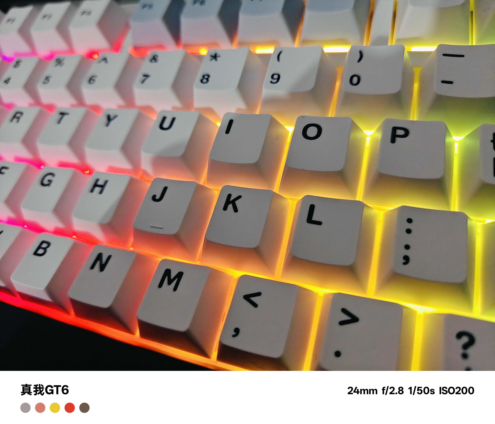
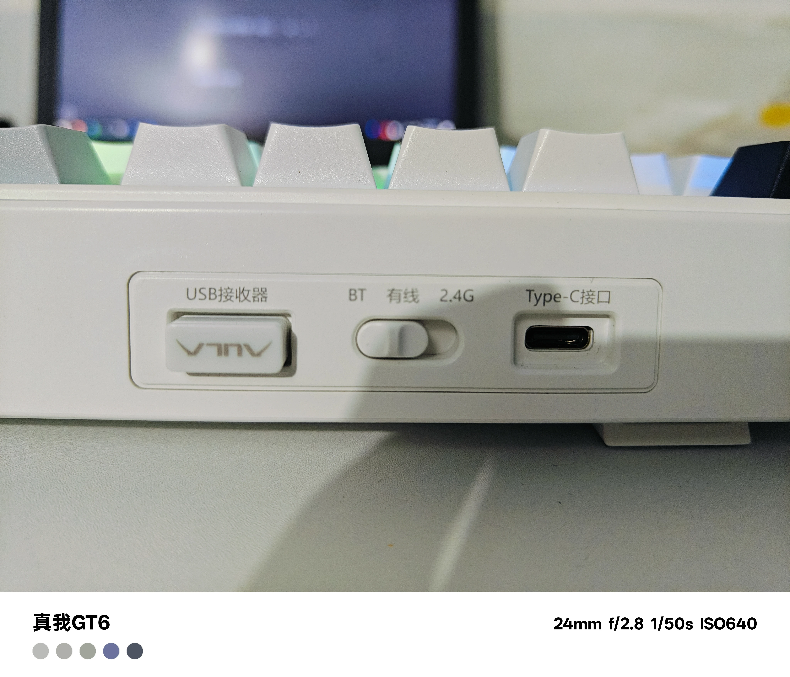
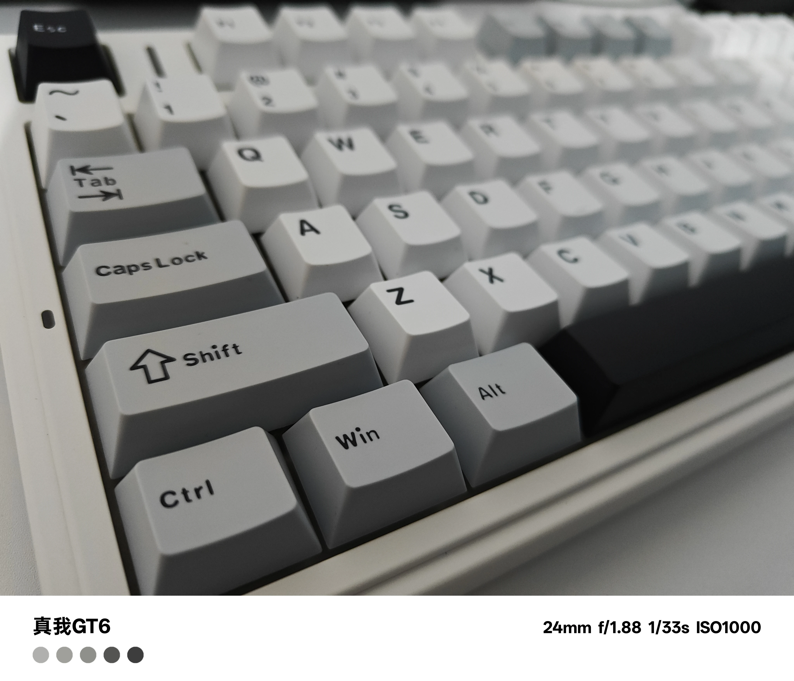
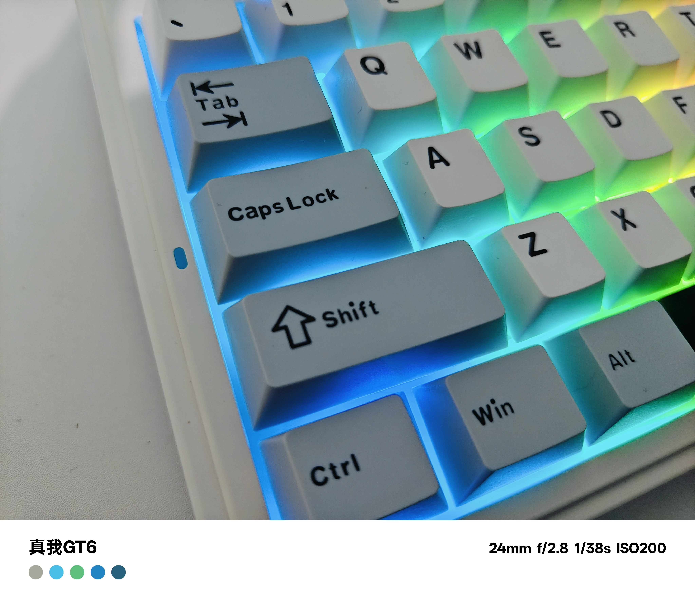

# 前言

嗨！大家好我是吹水明月，今年是 2024 年，可以说是年底了，提前祝大家新年快乐！

这次拿到的是我近期入手的一款 **性价比神器键盘——狼蛛 F75**，收割者轴。主要分享我这把键盘的参数、使用感受、优缺点分析。希望对想入手的朋友有帮助~

---

# 参数 & 配置

| 项目 | 说明 |
|------|------|
| 键盘布局 | 75% 紧凑布局（约 80 键） |
| 连接方式 | 有线 / 蓝牙 / 2.4G 三模连接 |
| 电池容量 | 内置 4000mAh 电池 |
| 结构 | 板簧 Gasket 结构 |
| 热插拔 | 全键无冲 + 全键热插拔 |
| 灯效 | 单色背光或 1680 万色 RGB 可选 |
| 键帽 | ABS 透光 OEM 或双色注塑 PBT 键帽 |

整体参数在这个价位段已经非常齐全，特别是 **三模连接 + 热插拔 + 消音填充结构** 都是亮点。

---

# 外观与做工

## 外观

整体采用紧凑的 75% 配列，非常适合桌面空间有限的办公 / 游戏场景，配色简洁干净。键盘上部设计了 **金属音量旋钮** 和功能键组合区域，线条利落。

## 做工质感

摸起来质感偏塑料感，但在这个价格区间内属于偏上水平。Gasket 结构让键盘整体敲击更“绵软”一些，不会太硬。

## 图片展示

---

# 使用感受

## 手感 & 轴体

我用的是 **收割者轴** 版本，轴体偏轻而且触发快速，整体反馈偏软，不会特别“刺耳”。适合日常打字和轻度游戏。

- **游戏体验**：因为连接稳定、响应快，打 **FPS / 动作游戏**时输入延迟很低。  
- **码字体验**：轴体偏轻，对于码字来说可能会有点误触，手指稍微搭一下就可能触发。  

整体感觉手感偏轻盈，如果喜欢重轴感受的人可能不太适合，这点看个人喜好。

## 连接体验

三模连接稳定，无线 2.4G 与蓝牙切换很方便。电池续航也不错，日常使用能撑好几天。

## 灯效 & 驱动

RGB 灯效颜色丰富，亮度还不错。可通过组合键调节模式和颜色，虽然官方驱动没有特别功能，内置效果也够用。

---

# 优缺点总结

### 优点

- **性价比高**：三模 + 热插拔 + Gasket 结构，在 200-300 价位中很难找到更全的配置。  
- **多样配色与轴体**：青轴/收割者/冰脉/新月等不同版本可选，满足不同风格。  
- **连接方式丰富**：支持有线 / 蓝牙 / 2.4G 三种连接。  
- **消音填充到位**：内部多层填充让声音更柔和不空洞。

### 缺点

- **轴体轻容易误触**：如果长时间码字，轻轴可能误触率偏高。  
- **键帽质感一般**：部分版本为 ABS 键帽，长期使用油光明显。  
- **蓝牙体验一般**：网上有用户反馈蓝牙偶尔会有延迟或连接小问题，不过咱插线常年不拔的就没啥影响hh。  

---

# 总结

对于一把大多数人日常使用的机械键盘来说，**狼蛛 F75 是非常值得推荐的选择**。它把常见的功能（如热插拔与三模连接）都放到了亲民价位，并且整体体验没有明显短板。

如果你是入门级机械键盘用户，或者预算不高但想要全功能体验，这款键盘绝对值得考虑。

---

# 附录：购买建议

- 如果你更喜欢**重手感**或不想误触，可以考虑选择偏重触发的轴体版本。  
- 键帽长期使用后油光明显建议升级为 PBT 键帽。  

---
