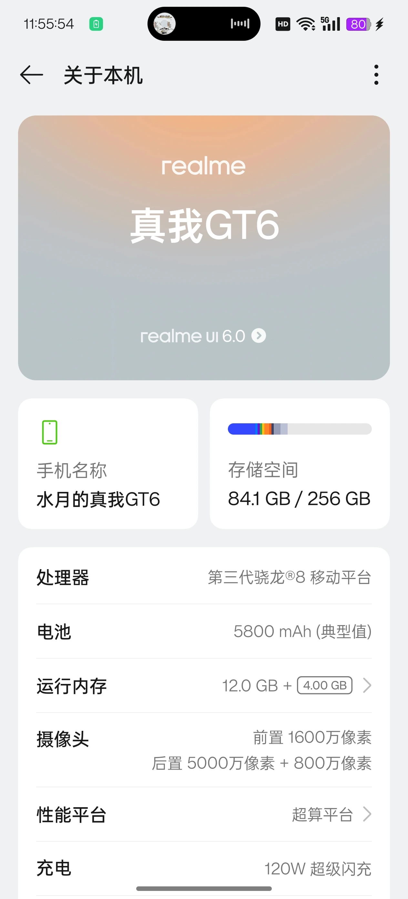
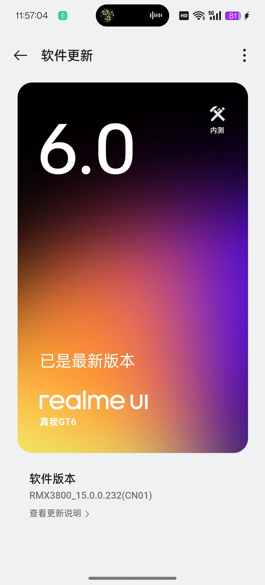
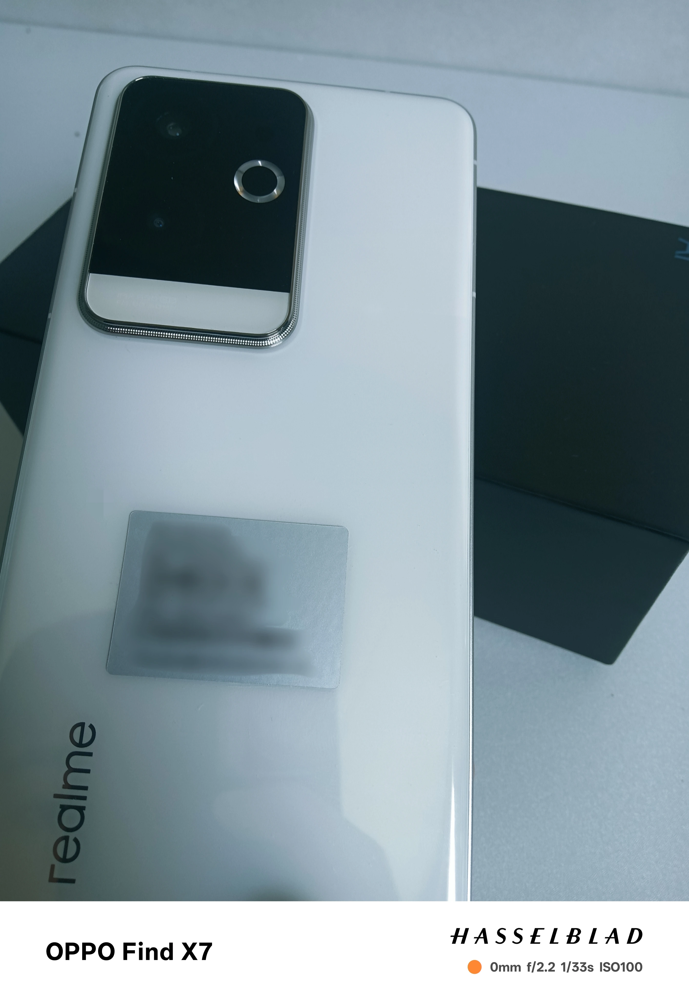

# 前言

11 月份的体验报告，主要是对 **Realme GT6** 的一些使用感受和体验。相较于首发瑕疵机，10 月生产的 GT6 在屏幕质量方面还是有点提升的。  
我拿到的机子是十月生产、双十一活动到手的 Realme GT6，这款机子的配置和屏幕还是很有性价比的！

---

# 正文

这台机子的充电速度很快，毕竟 **120W 快充**，10 多分钟就能充到一半以上，续航表现也很顶。  
屏幕方面还算比较护眼，长时间观看也不会明显不适；我个人对屏闪不敏感，看久了也不怎么头晕。  
到手第一时间我就刷了 **Realme UI 6 全量包**，续航与发热都很棒。  
但传统半腔扬声器的外放表现确实一般，而且上面的听筒也被砍掉了，整体音质只能说凑合。  
屏幕观感不错，**8 Gen 3** 的性能也够用。拍照方面我用得不多，就不展开了。

---

# 外观

整体设计延续 GT 系列的风格，线条利落、辨识度较高。拿在手里观感不错，做工也比较扎实。

---

# 图片展示

---

# 结语

谢谢您的阅读，请期待更多体验分享！ - 2024
